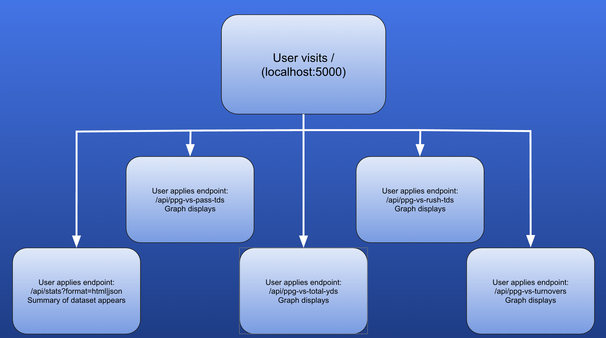

# College Football Offense Dashboard (Flask + Docker)

## 1) Executive Summary
**Problem:** Quickly explore how offensive metrics relate to scoring across FBS teams without heavyweight BI tooling.  
**Solution:** A lightweight Flask API that serves four correlation plots and a stats summary for a 2023 college football dataset. Everything is containerized for a one-command run.

## 2) System Overview
- **Course Concept(s):** Flask API + data visualization; containerization with Docker; env-based config.  
- **Data/Models/Services:** `cfb23.csv` (offensive stats), credited to **Jeff Gallini**; stored locally and mounted/baked into the image.  
- **Architecture:**  
  - Client requests PNG plots or HTML/JSON stats  
  - Flask loads CSV (path from `DATA_PATH`), cleans numeric fields  
  - Matplotlib produces scatter + best-fit line and correlation coefficient  
  - Responses cached off with no-store headers  
  
   <!-- add your diagram here -->

## 3) How to Run (Local via Docker)
```bash
# from Final-Project/
./run.sh
# or manually
docker build -t final-project:latest .
docker run --rm -p 5000:5000 --env-file .env.example final-project:latest
```
Health check: `curl http://localhost:5000/health`

Key endpoints:  
- `/` home with cards to plots and stats  
- `/api/ppg-vs-pass-tds`  
- `/api/ppg-vs-rush-tds`  
- `/api/ppg-vs-total-yds`  
- `/api/ppg-vs-turnovers`  
- `/api/stats?format=html|json`

## 4) Design Decisions
- **Why Flask + PNGs?** Simple, dependency-light way to serve plots without front-end frameworks.  
- **Env config:** `DATA_PATH`, `FLASK_RUN_PORT`, `MPLCONFIGDIR` avoid hard-coded paths.  
- **Tradeoffs:** Matplotlib PNGs are static; no interactivity. Correlations use linear fit only.  
- **Security/Privacy:** No user input beyond GET params; dataset is public/offline; no secrets committed.  
- **Ops:** Cached disabled to always show fresh plots; health endpoint for liveness; Docker for reproducibility.

## 5) Results & Evaluation
- Plots render within a second on a laptop; correlation line + r value shown on each plot.  
- Stats endpoint summarizes dataset with descriptive text plus JSON if needed.  
- Smoke tests cover health and one plot route via pytest.

## 6) What’s Next
- Add more endpoints (defense, efficiency) and interactive charts (Plotly/Altair).  
- Add CI to run pytest on push.  
- Add observability (basic request logging/metrics).  
- Provide hosted demo URL (optional extra credit).

## 7) Links
- **GitHub Repo:** <INSERT-REPO-URL>  
- **License:** MIT (see LICENSE)  
- **Dataset Credit:** Jeff Gallini (cfb23.csv)

## 8) Development & Testing
```bash
# install deps
pip install -r requirements.txt
# run app locally (non-Docker)
export DATA_PATH=cfb23.csv
python app.py
# tests
pytest
```

## 9) Repo Layout
```
Final-Project/
├─ app.py              # Flask app and routes
├─ cfb23.csv           # dataset (credit: Jeff Gallini)
├─ Dockerfile
├─ run.sh              # one-command build/run
├─ requirements.txt
├─ .env.example
├─ tests/
│  └─ test_app.py      # smoke tests
├─ assets/             # add architecture.png, screenshots here
└─ LICENSE
```
